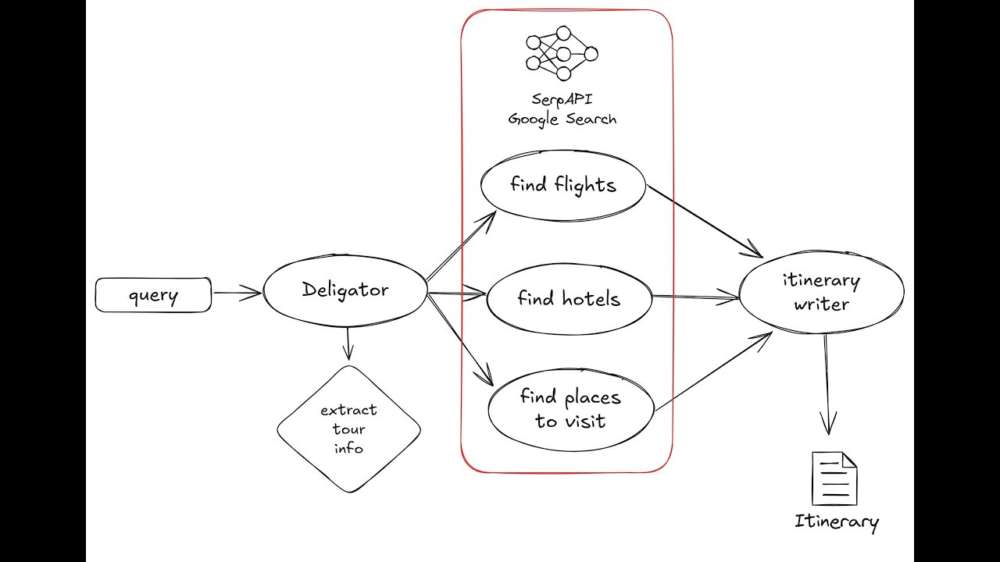

# Travel Planner Agent - Neuron V2
This project demonstrate how to create a tour planner using [Neuron](https://docs.neuron-ai.dev) Workflow.

Stack Used:

- Neuron Workflow for multi-agent orchestration.
- SerpAPI for finding hotels, flights and places to visit comprehensive research reports on any topic using large language models, 
with a focus on modularity, extensibility, and real-time results.



## Neuron PHP framework
Neuron is an agentic framework that allows you to create full-featured AI Agents in PHP.
It definitively fills the gap for AI Agents development between PHP and other ecosystems like Python or Javascript.

It provides you with a standard toolkit to implement AI-driven applications drastically reducing vendor lock-in.
You can switch between LLMs, vector stores, embedding providers, etc. with just a few lines of code without the
need to refactor big portions of your application.

If you are new to AI Agents development, or you already have experience, Neuron can be the perfect playground
to move your idea from experiments to reliable production implementations.

Check out the documentation: https://docs.neuron-ai.dev

## How to use this project
Download the project on your machine and open your terminal in the project directory. First, install the composer dependencies:

```
composer install
```

Create a `.env` file in your project root (see `.env.example` for a template), and provides the API keys based on 
the service you want to connect with.

```dotenv
ANTHROPIC_API_KEY=
GEMINI_API_KEY=
OPENAI_API_KEY=

SERPAPI_KEY=[required]

INSPECTOR_INGESTION_KEY=
INSPECTOR_TRANSPORT=sync
INSPECTOR_MAX_ITEMS=500
```

Execute the agent with the command below:

```
php research.php
```

## Workflow architecture and Nodes

### DeepResearchAgent: Orchestrates the overall report generation process

- **Planning**: Creates the structure of the report
- **GenerateSectionContent**: Generates content for each section using search results
- **Format**: Compiles the final report

### SearchWorkflow: Handles search operations as a nested workflow

- **GenerateQueries**: Creates search queries based on section topics
- **SearchTheWeb**: Executes parallel searches and processes results

## Monitoring & Debugging

Integrating AI Agents into your application, you're not working only with functions and deterministic code,
you program your agent also influencing probability distributions. Same input ≠ output.
That means reproducibility, versioning, and debugging become real problems.

Many of the Agents you build with Neuron will contain multiple steps with multiple invocations of LLM calls,
tool usage, access to external memories, etc. As these applications get more and more complex, it becomes crucial
to be able to inspect what exactly your agent is doing and why.

Why is the model taking certain decisions? What data is the model reacting to? Prompting is not programming
in the common sense. No static types, small changes break output, long prompts cost latency,
and no two models behave exactly the same with the same prompt.

The best way to do this is with [Inspector](https://inspector.dev). After you sign up,
make sure to set the `INSPECTOR_INGESTION_KEY` variable in the application environment file to start monitoring:

```dotenv
INSPECTOR_INGESTION_KEY=fwe45gtxxxxxxxxxxxxxxxxxxxxxxxxxxxx
```

After configuring the environment variable, you will see the agent execution timeline in your Inspector dashboard.